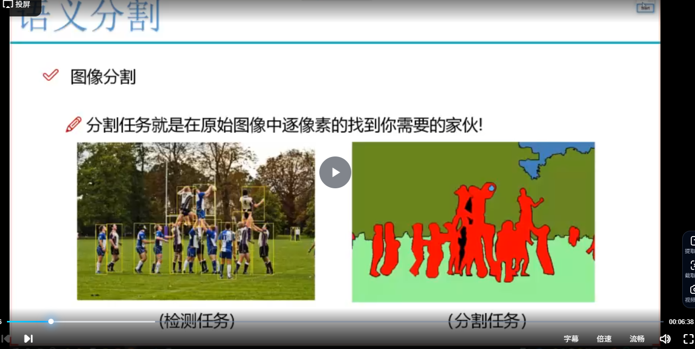
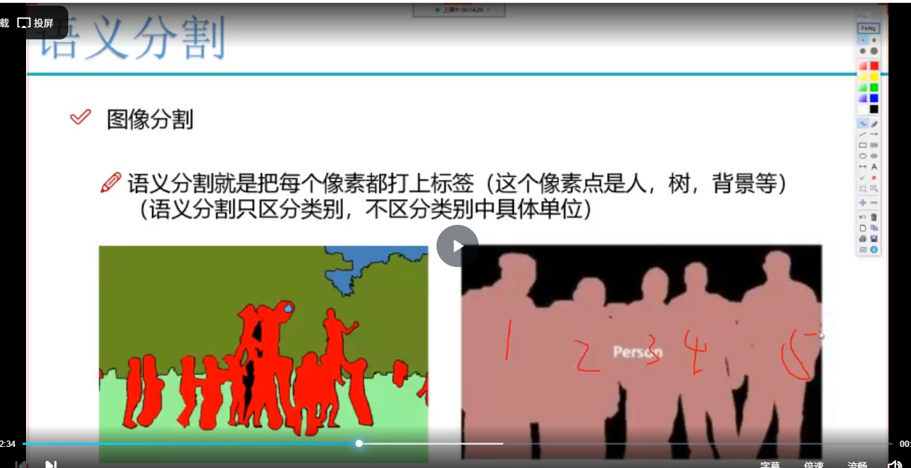
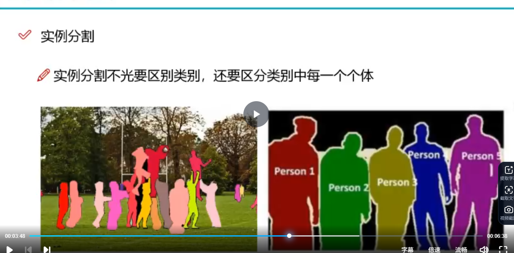
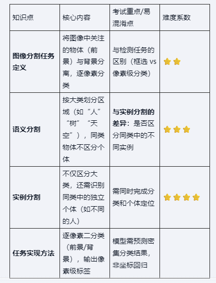

# 图像语义分割与实例分割概述

### 1.检测任务

- ***核心功能***： 在图像中将目标物体使用边界框框出，如行人检测中框出所有的行人
- ***应用的场景***：计算机视觉中最经典的任务之一，适用于物体检测，行人检测等多个领域
- ***输出形式***：只需要给出物体所在矩形区域的坐标点（左上和右下两点的坐标）
- 

### 2.分割任务

- 
- ***核心功能*** ：逐像素识别图像中所需要的目标，类似PS抠图的效果
- ***与检测的区别***：
  - 检测：使用矩形框粗略的定位
  - 分割：精确到像素级的区域划分
- ***典型输出***：将图像分成多个区域（如人，草地，树木，蓝天），前景和背景分离

## 一、语义分割

### 

- ***定义***：为每个像素打上类别的标签（如人、树、背景等）
- ***特点***：
  - 只区分类别，不区分同类中的具体个体
  - 同类物体使用相同的颜色标记（如图中多个人使用红色表示）

- ***应用实例***：简单分为前景（人）和背景（干扰因素）两类

## 二、实例分割

- 

- ***定义***：在语义分割的基础上进一步区分同类中的不同个体

- ***特点***：

  - 既要区分大类别（如人vs树）
  - 又要区分同类个体（如人1，人2，人3）

- ***与语义分割的对比***

  - 语义分割：将五个人标记为一类
  - 实例分割：为五个人分别编号标记

- ***技术实现***：

  - 逐像素进行多分类判断

  - 常用交叉熵损失函数：
    $$
    loss  = -pos\_weight*y_{true}log(y_{pred})-(1-y_{ture})log(1-y_{ture})
    $$

  - 需要考虑样本均衡的问题：
    $$
    pos\_weight=\frac{num\_neg}{num\_pos}
    $$

  - ***网络输出***：

    - 检测任务输出坐标点
    - 分割任务输出每个像素的分类结果

  - ***基础实现***：对每个像素点进行二分类（前景/背景）

  - ***扩展应用***：多类别的分割任务

## 知识总结

​       

